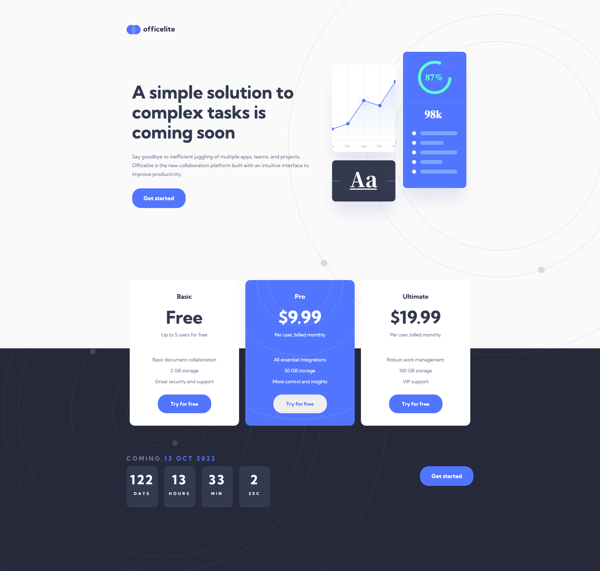

### FRONTEND MENTOR | OFFICELITE COMING SOON PAGE

Netlify url: https://gleeful-brigadeiros-ac1e49.netlify.app/

### | Description | ###

Officelite Coming Soon @ Frontend Mentor.

Frontend Mentor url: https://www.frontendmentor.io/challenges/officelite-coming-soon-site-M4DIPNz8g

A single page web with subscription cards and a dynamic clock build with Javascript.

Made use of FIGMA files to build up my HTML file with classes and id's.
You can make use of their styleguide and create UTILITIES + VARIABLES fromt it. This gives an efficient workflow to your work.

Afterwards I've made it responsive with flexbox and media querries.

### | My Final Solution | ###

Toolbox: HTML + CSS + Javascript.

### | Evaluation | ###

Learned a lot in this project. Working with flexboxes, responsive design and some Javascript to create the dynamic clock + add in the HTML & CSS.
Working with flexboxes gives you a lot of possibilities to edit you website and or edit it like it's in the FIGMA.

Adding those utilities and variables are an great lifesafer to speed up my workflow and to keep my code clean!

My next project will be an another one from Frontend Mentor, which I will starat in a reverse order, from mobile to desktop, so the responsive tweaks will go much easier! 

Happy coding!
